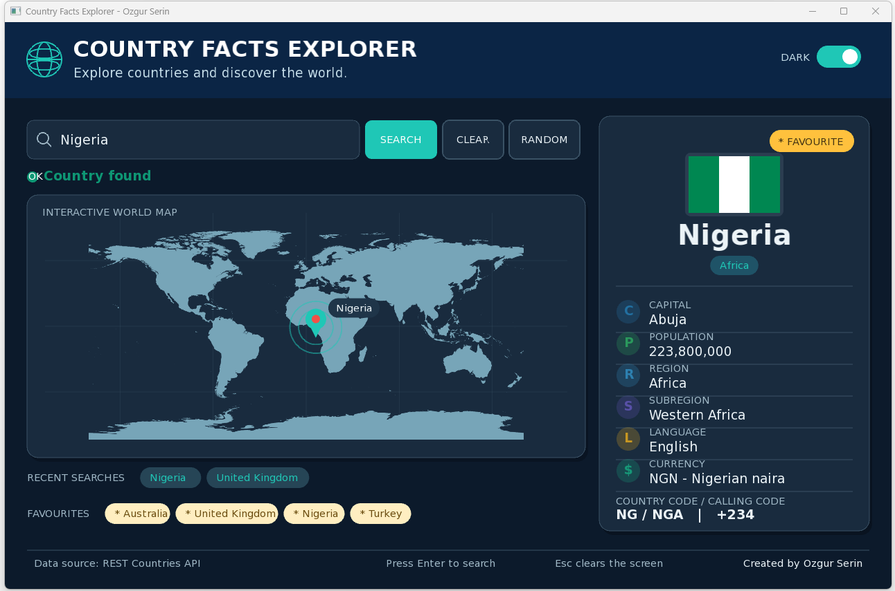

# Country Facts Explorer

Country Facts Explorer is a C++ openFrameworks data-driven application that uses the REST Countries API to search for countries and display useful country information.

The project was created for the CodeLab II Data Driven App assessment.



## Features

- Search for a country by name
- Display the country flag
- Show capital city
- Show population
- Show region and subregion
- Show languages
- Show currency
- Show country and calling codes
- Show the country location on a world map
- Add and remove favourite countries
- Save favourites between sessions
- Show the five most recent searches
- Open countries from favourites and recent searches
- Random country search
- Light and dark themes
- Loading, success and error states
- Error handling for invalid country searches
- Empty search validation
- Keyboard support using Enter and Esc
- Responsive layout for different window sizes

## Technologies Used

- C++
- openFrameworks
- REST Countries API
- JSON data
- Asynchronous HTTP requests
- Object-oriented programming
- C++ vectors
- Local JSON file handling
- Visual Studio

## Technical Implementation

The application separates the main responsibilities into different classes:

- `Country` stores the country information returned by the API.
- `CountryService` loads the API settings, builds the request URL and parses the returned JSON data.
- `Button` represents clickable interface buttons.
- `ofApp` manages the main interface, user input and application behaviour.

Country requests are sent asynchronously using openFrameworks. The application uses `Idle`, `Loading`, `Success` and `Error` states to control the interface while a search is being processed.

Recent searches and favourites are stored using C++ vectors. Favourites are also saved to a local JSON file so that they remain available after restarting the application.

## Project Structure

```text
Data Driven App/
└── CountryFactsExplorer_Ozgur/
    ├── src/
    │   ├── Button.cpp
    │   ├── Button.h
    │   ├── Country.cpp
    │   ├── Country.h
    │   ├── CountryService.cpp
    │   ├── CountryService.h
    │   ├── main.cpp
    │   ├── ofApp.cpp
    │   └── ofApp.h
    │
    ├── bin/
    │   └── data/
    │       ├── fonts/
    │       │   ├── DejaVuSans.ttf
    │       │   ├── DejaVuSans-Bold.ttf
    │       │   └── FONT_LICENSE.txt
    │       ├── world_map.png
    │       ├── MAP_SOURCE.txt
    │       └── settings.example.json
    │
    ├── dll/
    ├── addons.make
    ├── config.make
    ├── CountryFactsExplorer.sln
    ├── CountryFactsExplorer.vcxproj
    ├── CountryFactsExplorer.vcxproj.filters
    └── icon.rc
```

## How to Run the Project

1. Install openFrameworks.
2. Place the `CountryFactsExplorer_Ozgur` folder inside the openFrameworks `apps/myApps` folder.
3. Open `bin/data/settings.example.json`.
4. Make a copy of this file and rename the copy to `settings.json`.
5. Add your own REST Countries API key to `settings.json`.
6. Open `CountryFactsExplorer.sln` in Visual Studio.
7. Select the x64 configuration.
8. Build the solution.
9. Run the application.

## Local Files Not Included

Some local files are intentionally not included in this public repository.

### `settings.json`

This file contains the local API key. It is not included for security reasons.

A safe example file called `settings.example.json` is included instead.

### `favourites.json`

This file is created while the application is running and stores the user's saved favourite countries. It is local runtime data and is not required in the source repository.

### `.vs/`

This folder contains temporary Visual Studio files created on the local computer.

### `obj/`

This folder contains temporary build files generated during compilation.

### `.exe`, `.pdb` and `.ilk` files

These files are generated when the project is built. They are not required as part of the source code repository.

### `.vcxproj.user`

This file contains local Visual Studio user settings and is different for each computer.

These files are excluded using the `.gitignore` file.

## Testing

The application was tested during development and again after the final changes.

Testing included:

- Valid country searches
- Invalid country searches
- Empty searches
- Country information
- Currency information
- Country flags
- World map locations
- Adding and removing favourites
- Favourite persistence after restarting the application
- Recent searches
- Duplicate recent searches
- Random country searches
- Light and dark themes
- Keyboard controls
- Small and large window sizes
- Final Visual Studio rebuild

The final Visual Studio rebuild completed successfully with two succeeded projects and zero failed projects.

## Sources

- REST Countries API: https://restcountries.com/
- openFrameworks: https://openframeworks.cc/
- World map source and licence information: see `bin/data/MAP_SOURCE.txt`
- Font licence information: see `bin/data/fonts/FONT_LICENSE.txt`

## Author

Ozgur Serin
